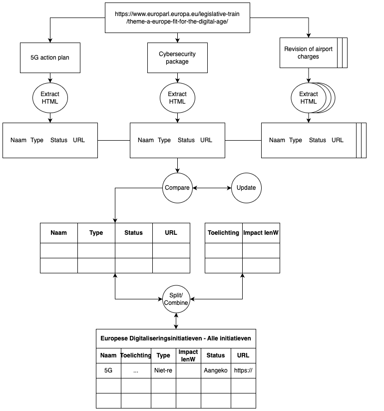

# European Digital Initiatives Scraper

**by Mayla Kersten**

The European Digital Initiatives Tracker is a Python program designed to scrape, update, and store information about European digital initiatives from the [European Parliament's website](https://www.europarl.europa.eu/legislative-train/theme-a-europe-fit-for-the-digital-age/). This tool helps in maintaining an up-to-date database of initiatives by fetching details such as initiative name, type, status, details, and relevant URLs, and then writing this information into an Excel file.

The logic of the code is as follows:

## Run the program
1. Check if you are in the correct directory
2. Activate the `source venv/bin/activate`
3. Run `python3 main.py`
4. Result in output/

## Getting Started
1. Clone the repository with: `git clone https://github.com/himayla/eu_scraper.git`
2. Create a virtual environment: `python -m venv venv` or `python3 -m venv venv` 
3. Activate the virtual environment: `source venv/bin/activate`
4. Install the reqiured packages: `pip install -r requirements.txt` 
5. Run the program: `python main.py` or `python3 main.py`

## Code
* **parameters.json** - Contains configuration parameters for the program, such as settings for the scraping process.
* **main.py** - The main script that executes the scraping, updating, and writing of initiatives to an Excel file.
* **helpers.py** - Contains helper functions for loading initiatives and writing data to Excel.

## Logging
The script logs important information, including:

- The start time of the script.
- The number of new initiatives found.
- Updates made to existing initiatives.
- The total runtime of the script.

## License
This project is open-source and available under the MIT License.